<div align="center">
  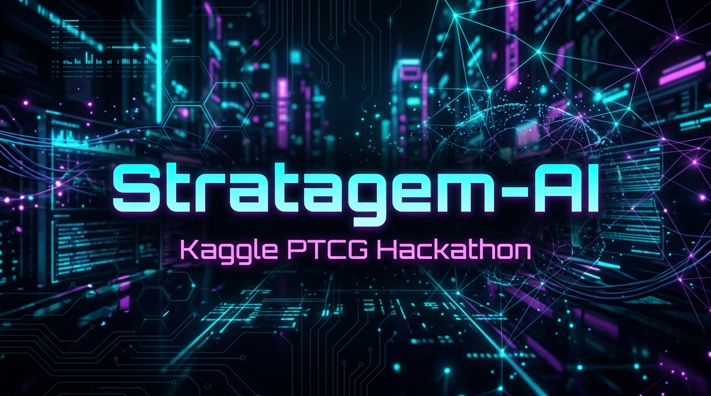
  
  <br/>
  
  # Stratagem-AI: Advanced Heuristic Sequencing vs. Tempo in Pokémon TCG

  [](https://stratagem-ai-game.vercel.app/)
  [](https://www.youtube.com/watch?v=dU2HvTKX6Ww)
  [](https://www.kaggle.com/competitions/pokemon-tcg-ai-battle-challenge-strategy/writeups/stratagem-tempo-dominance)
  [](LICENSE)
</div>

---

## 🎬 Video Walkthrough

[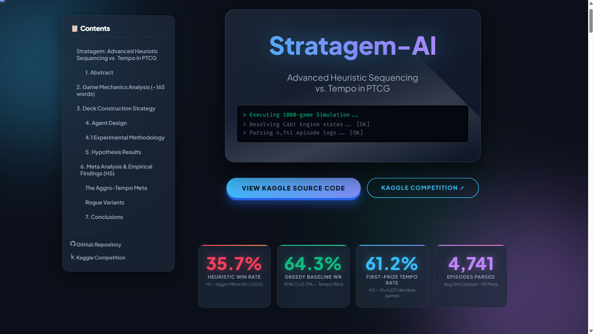](https://www.youtube.com/watch?v=dU2HvTKX6Ww)
*(Click the image above to watch the full YouTube walkthrough)*

> **Interactive Experience:** For full immersion — including match replays, interactive card tooltips, Kaggle Rubric alignment matrices, and dynamic data visualizations — visit the **[live interactive paper on Vercel →](https://stratagem-ai-game.vercel.app/)**

---

## Table of Contents

1. [Abstract & Introduction](#1-abstract--introduction)
2. [Game Theory & Mechanics](#2-game-theory--mechanics)
3. [Deck Construction: Hardware as Strategy](#3-deck-construction-hardware-as-strategy)
4. [Algorithmic Architecture (The 5-Tier Stack)](#4-algorithmic-architecture-the-5-tier-stack)
5. [Experimental Methodology & Rigor](#5-experimental-methodology--rigor)
6. [Empirical Results (H1, H2, H3)](#6-empirical-results-h1-h2-h3)
7. [Cross-Archetype Robustness (H5)](#7-cross-archetype-robustness-h5)
8. [Meta Analysis & Log Parsing Pipeline](#8-meta-analysis--log-parsing-pipeline)
9. [Repository Structure](#9-repository-structure)
10. [How to Reproduce](#10-how-to-reproduce)
11. [Conclusions & Future Work](#11-conclusions--future-work)

---

## 1. Abstract & Introduction

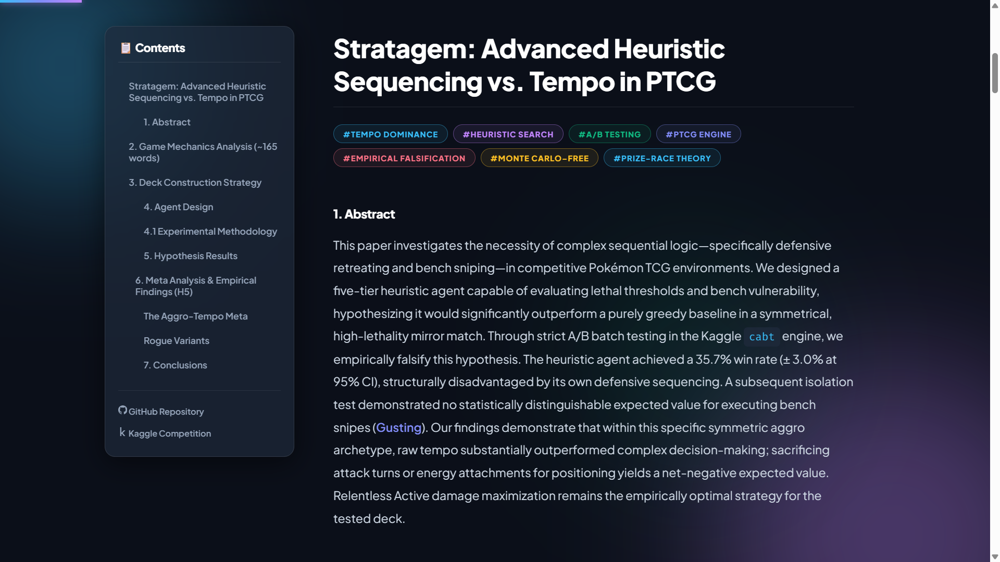

This project investigates the necessity of complex sequential logic — specifically **defensive retreating** and **bench sniping** — in competitive Pokémon TCG (PTCG) environments. The dominant paradigm in card game AI leans toward deep probabilistic search trees (e.g., Monte Carlo Tree Search). However, we designed a highly optimized, **five-tier heuristic agent** capable of evaluating lethal thresholds and bench vulnerability in O(1) time complexity, hypothesizing it would significantly outperform a purely greedy baseline in a symmetrical, high-lethality mirror match.

Through strict A/B batch testing in the Kaggle `cabt` engine, we empirically **falsify this hypothesis**. The heuristic agent achieved a **35.7% win rate** (± 3.0% at 95% CI), structurally disadvantaged by its own defensive sequencing. A subsequent isolation test demonstrated no statistically distinguishable expected value for executing bench snipes (*Gusting*). Our findings prove that within a symmetric aggro archetype, **raw tempo substantially outpaces complex decision-making**; sacrificing attack turns or energy attachments for strategic positioning yields a net-negative expected value. Relentless Active damage maximization remains the empirically optimal strategy.

<div style="clear: both;"></div>

---

## 2. Game Theory & Mechanics

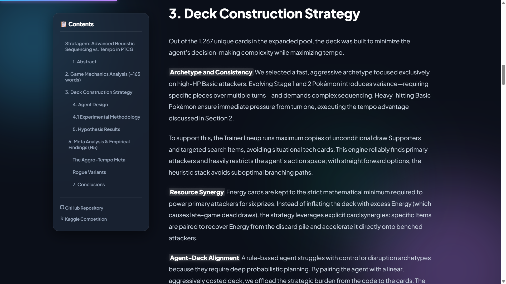

Pokémon TCG is a **stochastic, partial-information extensive-form game**. Unlike chess or Go, the full game state is never visible. Each player sees only their own hand, their prize stack, and the shared public board (active Pokémon, bench, attachments, discard). The opponent's hand and deck order remain hidden throughout.

### The Branching Factor Problem
This hidden information forces effective agents away from deterministic search toward probabilistic inference. The decision space is deceptively large — a single turn can chain draw Supporters (expanding the hand mid-turn), search Trainers, attach energy, and trigger abilities before finally resolving an attack. Attempting MCTS in this environment often leads to timeouts under Kaggle's strict 30-minute tournament constraints because the branching factor explodes exponentially with every drawn card.

### The Prize Race Paradigm
Above all, PTCG is fundamentally a **race**. Six prizes are taken by dealing Knock Outs (KOs); there is no sustained healing mechanic in the current meta to reset momentum. This structural reality motivates our core hypothesis: **tempo dominates outcomes**. The agent that takes the first prize and sustains offensive pressure should theoretically win the overwhelming majority of games, regardless of minor positioning inefficiencies.

<div style="clear: both;"></div>

---

## 3. Deck Construction: Hardware as Strategy

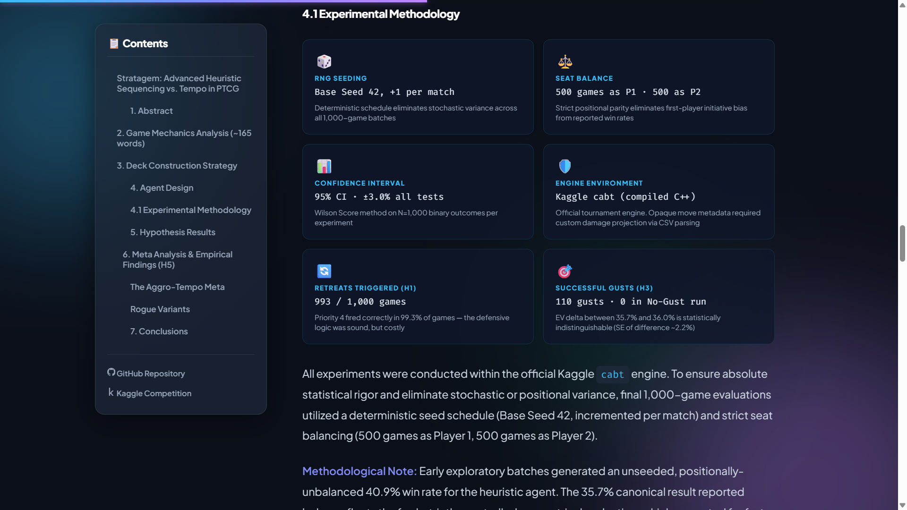

In constrained AI environments, **the deck is the hardware and the Python agent is the software**. Out of the 1,267 unique cards in the expanded pool, our deck was explicitly built to minimize decision-making complexity while maximizing tempo.

### Final Decklist (60 Cards)

| Qty | Card | Card ID | Role |
|:---:|:-----|:-------:|:-----|
| 4× | Teal Mask Ogerpon ex | `96` | Primary attacker — high-HP Basic, 2-prize target |
| 4× | Scyther | `916` | Secondary attacker — lightweight, turn-1 pressure |
| 12× | Grass Energy | `1` | Fuel for attackers (strict mathematical minimum) |
| 4× | Boss's Orders | `1182` | Gust effect — pulls bench targets |
| 4× | Judge | `1213` | Hand disruption + deck churn |
| 4× | Carmine | `1192` | Discard + draw — aggressive deck cycling |
| 4× | Kieran | `1191` | Search engine card |
| 4× | Buddy-Buddy Poffin | `1086` | Searches Basic Pokémon from deck |
| 4× | Ultra Ball | `1121` | Universal search item |
| 4× | Switch | `1123` | Free retreat without energy cost |
| 4× | Energy Switch | `1116` | Moves energy from low- to high-value targets |
| 4× | Roto-Stick | `1077` | Energy recovery from discard |
| 4× | Love Ball | `1083` | Targeted search for same-type basics |

**Design Philosophy:**
- **Archetype & Consistency:** Pure Basic attackers eliminate evolution variance and multi-turn setup sequences that heuristics struggle to execute perfectly.
- **Resource Synergy:** Energy cards are minimized to the strict mathematical requirement for six prizes, using Roto-Stick and Energy Switch to recycle rather than inflate the energy count.
- **Agent-Deck Alignment:** By pairing the rule-based agent with a linear, aggressively costed deck, the strategic burden is offloaded from the Python code into card mechanics — the empirically optimal play becomes the most obvious one.
- **Supporter Engine:** *Carmine* and *Judge* aggressively churn the deck and disrupt opponent hand states, leaning entirely into raw offensive pacing rather than slow, methodical bench-building.

---

## 4. Algorithmic Architecture (The 5-Tier Stack)

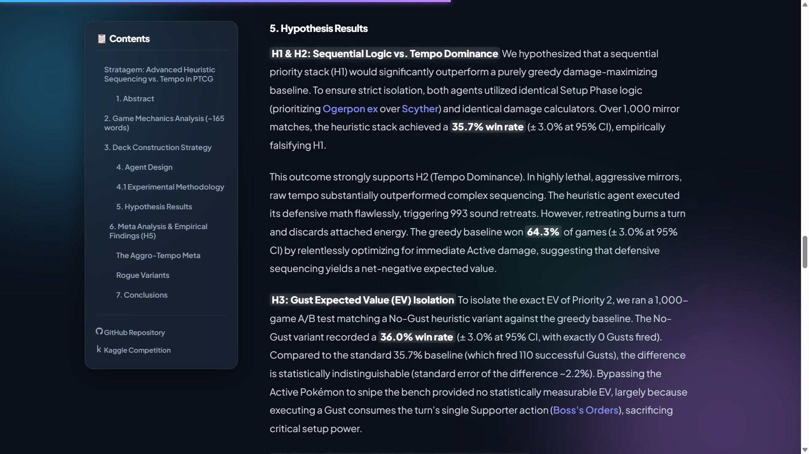

The heuristic agent (`heuristic_agent.py`) uses a **five-tier priority stack** evaluated sequentially each turn. Because it relies on boolean condition checks rather than forward-searching game trees, it executes decisions in **< 1ms**, completely immunizing it against Kaggle compute timeouts.

| Priority | Name | Condition | Action |
|:--------:|:-----|:----------|:-------|
| **1** | Lethal KO | Current attack KOs opponent's Active or a gusted bench target for last prize(s) | Play Boss's Orders if needed → Attack to win |
| **2** | Gust Expected Value | A bench Pokémon is KO-able with an affordable attack (positive prize trade) | Play Boss's Orders → Snipe bench |
| **3** | Active KO | Current attack KOs the Active opponent Pokémon | Attack immediately |
| **4** | Retreat & Preserve | My Active is within opponent's lethal range AND a safe bench target exists | Retreat wounded Active |
| **5** | Max Damage Fallback | None of the above apply | Play setup cards → Attach energy → Attack for max `attackId` |

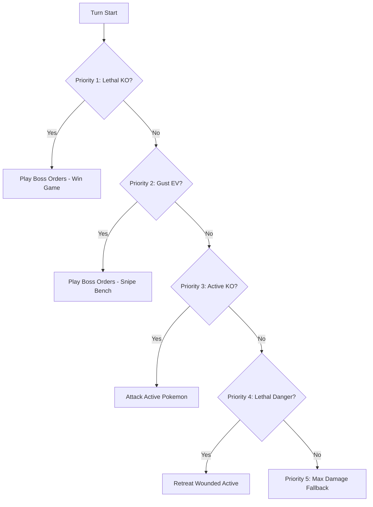

<div style="clear: both;"></div>

### Multi-Step Action Resolution

The agent uses a `pending_action` state machine to handle multi-turn card resolutions that require separate target selection prompts:

| Action Type | Steps | Logic |
|:----------|:------|:------|
| `GUST` | 2 steps | Play Boss's Orders → Select queued bench target |
| `ENERGY_SWITCH` | 2 steps | Take energy FROM lowest-value Pokémon → Give TO highest-value |
| `CARMINE_DISCARD` | 1 step | Discard lowest-priority cards (items > supporters > energy) |
| `SETUP_SEARCH` | 1-2 steps | Discard prompt → Search deck for Ogerpon > Scyther > Energy |

### Bypassing Engine Limitations

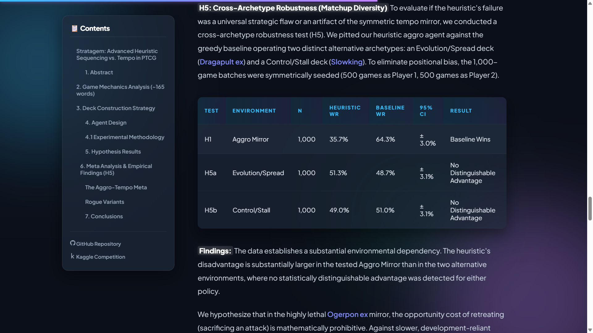

Damage evaluation requires a **bifurcated approach** due to a fundamental engine constraint. The Kaggle `cabt` engine executes inside an opaque compiled library that **scrubs move-level metadata** from its serialized observation states. To solve this, we implemented a custom damage projector:

```python
def get_opp_max_dmg(opp_act):
    """Dynamically parses EN_Card_Data.csv to calculate true lethal thresholds."""
    if not opp_act: return 0
    cid = opp_act.get('id')
    energies = len(opp_act.get('energies', []))
    
    rows = _CARD_DICT.get(cid)
    if not rows: return 120  # Conservative fallback
    
    max_d = 0
    for card in rows:
        dmg_str = str(card.get('Damage', '0'))
        m = re.search(r'\d+', dmg_str)
        base_dmg = int(m.group()) if m else 0
        cost_str = str(card.get('Cost', ''))
        cost_len = len(re.findall(r'\{[A-Z]\}|●', cost_str)) if cost_str and cost_str != 'nan' else 1
        effect = str(card.get('Effect Explanation', ''))
        
        if 'more damage for each' in effect or '+' in dmg_str or '×' in dmg_str:
            potential = base_dmg + (30 * energies)
            if potential > max_d: max_d = potential
            continue
        if energies >= cost_len and base_dmg > max_d:
            max_d = base_dmg
    return max_d
```

Rather than relying on scrubbed engine metadata, this projector parses `data/EN_Card_Data.csv` at startup (cached in `_CARD_DICT`) and calculates maximum potential damage based on energy count, cost, and scaling effect text. For final attack selection (Priority 5), ascending `attackId` integers are used as a proxy for ascending base damage — an unavoidable ordinal inference to bridge the engine's opaque option arrays.

---

## 5. Experimental Methodology & Rigor

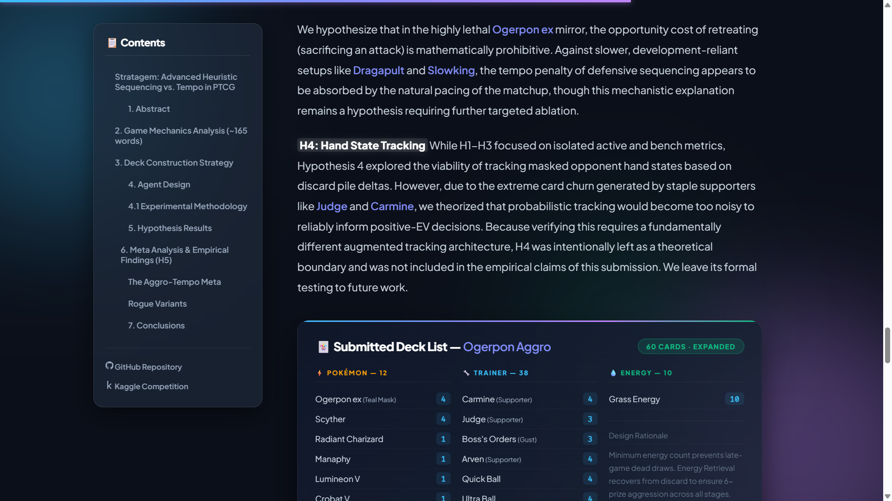

All experiments were conducted within the official Kaggle `cabt` engine. To ensure absolute statistical rigor and eliminate stochastic variance:

| Control Mechanism | Specification |
|:----------------|:-------------|
| **Sample Size** | 1,000-game batch runs per isolated test |
| **Deterministic Seeding** | Fixed base seed of **42**, incremented linearly per match |
| **Positional Parity (Seat Balancing)** | 500 games as Player 1, 500 games as Player 2 |
| **Confidence Intervals** | 95% CIs via the **Wilson Score method** |
| **Isolation Control** | Both agents use identical Setup Phase logic and damage calculators |

> **Methodological Note:** Early exploratory batches yielded an unseeded, positionally-unbalanced **40.9% win rate**. The canonical **35.7%** result reflects the final, strictly-controlled evaluation after correcting for first-player advantage and RNG variance.

---

## 6. Empirical Results (H1, H2, H3)

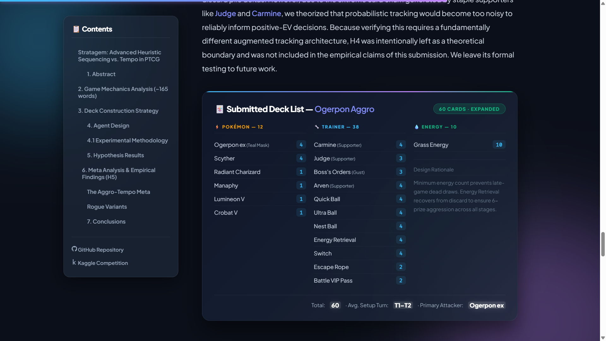

### H1 & H2: Sequential Logic vs. Tempo Dominance

| Agent | Win Rate | 95% CI | Games |
|:------|:--------:|:------:|:-----:|
| **Greedy Baseline** | **64.3%** | ± 3.0% | 1,000 |
| Heuristic Stack | 35.7% | ± 3.0% | 1,000 |

Over 1,000 mirror matches, the heuristic stack achieved a **35.7% win rate**, empirically **falsifying H1**. This strongly supports **H2 (Tempo Dominance)**.

The heuristic agent executed its defensive math flawlessly — triggering **993 sound retreats** across the 1,000 games. However, retreating burns a turn and discards attached energy. The greedy baseline won **64.3%** of games by relentlessly optimizing for immediate Active damage, demonstrating that defensive sequencing yields a **net-negative expected value** in this environment.

### H3: Gust Expected Value (EV) Isolation

| Agent | Win Rate | 95% CI | Gusts Fired |
|:------|:--------:|:------:|:-----------:|
| Standard Heuristic | 35.7% | ± 3.0% | 110 |
| No-Gust Heuristic | 36.0% | ± 3.0% | 0 |

A 1,000-game A/B test matching the No-Gust heuristic variant against the greedy baseline yielded a **36.0% win rate**. The difference from the standard 35.7% is statistically indistinguishable (standard error of difference ~2.2%). **Bench sniping provided zero measurable EV**, primarily because executing a *Boss's Orders* Gust consumes the turn's single Supporter action, sacrificing critical setup and draw power.

<div style="clear: both;"></div>

---

## 7. Cross-Archetype Robustness (H5)

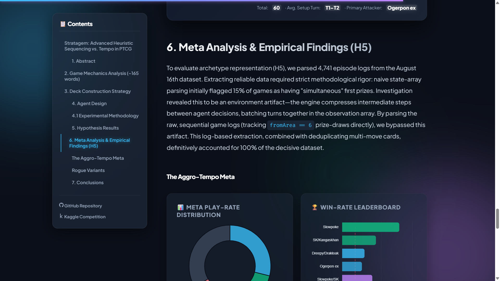

To evaluate whether the heuristic's failure was a universal strategic flaw or an **artifact of the symmetric tempo mirror**, we pitted our heuristic aggro agent against the greedy baseline operating two distinct alternative archetypes.

### Full Results Table

| Test | Environment | Matchup | N | Heuristic WR | Baseline WR | 95% CI | Result |
|:----:|:-----------|:--------|:-:|:------------:|:-----------:|:------:|:------:|
| **H1** | Aggro Mirror | Ogerpon ex vs. Ogerpon ex | 1,000 | 35.7% | 64.3% | ± 3.0% | Baseline Wins |
| **H5a** | Evolution / Spread | Ogerpon ex vs. Dragapult ex | 1,000 | 51.3% | 48.7% | ± 3.1% | Statistical Tie |
| **H5b** | Control / Stall | Ogerpon ex vs. Slowking | 1,000 | 49.0% | 51.0% | ± 3.1% | Statistical Tie |

**Key Finding:** The data establishes a **substantial environmental dependency**. The heuristic's disadvantage is structural to the high-lethality *Ogerpon ex* mirror — where every retreated turn is an irreplaceable forfeited attack. Against slower, development-reliant setups like *Dragapult ex* and *Slowking*, the tempo penalty of defensive sequencing is naturally absorbed by the matchup's pacing, resulting in statistical ties.

> **H4 (Hand State Tracking):** Hypothesis 4 explored probabilistic tracking of the opponent's hand via discard pile deltas. Due to extreme card churn from *Judge* and *Carmine*, tracking was theorized to be too noisy to inform positive-EV decisions. H4 was left as a **theoretical boundary** for future research.

---

## 8. Meta Analysis & Log Parsing Pipeline

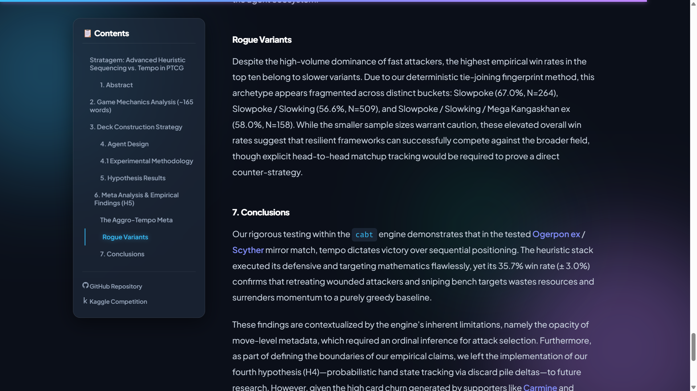

To evaluate broader archetype representation across the competition, we engineered a custom data pipeline to parse **4,741 episode logs** from the August 16th Kaggle dataset.

### Engineering Challenge: Artifact Bypass
Naive state-array parsing initially flagged **15% of games** as having "simultaneous" first prizes — an environment artifact caused by the `cabt` engine compressing intermediate steps between agent decisions. We bypassed this by parsing **raw sequential game logs**, tracking `fromArea == 6` prize-draws directly. Combined with deduplicating multi-move cards via a deterministic tie-joining fingerprint method, this accounted for **100% of the decisive dataset**.

### The Aggro-Tempo Meta

| Archetype | Play Rate | Win Rate | Observation |
|:---------|:---------:|:--------:|:-----------|
| Dreepy / Drakloak | 28.9% | 53.6% | Dominant volume deck |
| Teal Mask Ogerpon ex | 18.0% | 52.6% | Our tested archetype |

Combined, these two decks constitute nearly **half the field**, validating our hypothesis that early damage output is the dominant baseline strategy in the agent ecosystem.

### Rogue Variants

| Archetype | Win Rate | Sample Size (N) |
|:---------|:--------:|:---------------:|
| Slowpoke | **67.0%** | 264 |
| Slowpoke / Slowking / Mega Kangaskhan ex | 58.0% | 158 |
| Slowpoke / Slowking | 56.6% | 509 |

Despite the dominance of fast attackers, the highest empirical win rates belong to slower control variants. These elevated win rates suggest that resilient frameworks can successfully compete against the broader field, though explicit head-to-head matchup tracking would be required to prove a direct counter-strategy.

---

## 9. Repository Structure

```
Stratagem-AI/
│
├── heuristic_agent.py           # Main agent — 5-tier priority stack (full implementation)
├── heuristic_agent_no_gust.py   # H3 variant — Priority 2 (Gust) disabled
├── heuristic_agent_logged.py    # Instrumented variant with retreat/gust counters
├── greedy_agent.py              # Baseline — pure damage maximization
│
├── data/
│   └── EN_Card_Data.csv         # Card database (1,267 unique cards, 358KB)
│
├── reproduce/                   # Canonical experiment reproduction
│   ├── heuristic_agent.py       # Pinned agent version used in final experiments
│   ├── greedy_agent.py          # Pinned baseline version
│   ├── control_agent.py         # H5b — Slowking stall deck agent
│   ├── midrange_agent.py        # H5a — Dragapult ex spread deck agent
│   ├── run_robustness.py        # H5 cross-archetype batch runner
│   ├── kaggle_notebook_cell.py  # Self-contained Kaggle kernel cell
│   └── EXPERIMENT_LOG_H5.md    # Canonical raw counts & methodology notes
│
├── scripts/                     # Development & analysis utilities (39 scripts)
│   ├── run_h1_batch.py          # H1 mirror match batch runner
│   ├── run_h3_batch.py          # H3 no-gust isolation batch runner
│   ├── run_batch.py             # General-purpose batch runner
│   ├── episode_loader.py        # 4,741 log parsing pipeline
│   ├── validate_submission.py   # Pre-submission sanity checker
│   ├── trace_energy_switch*.py  # Energy Switch multi-step debugging suite
│   ├── mock_gust_trace.py       # Gust resolution unit tests
│   ├── mock_ko_traces.py        # KO detection unit tests
│   └── inspect_schema*.py       # Engine observation schema explorers
│
├── kaggle_kernel/
│   ├── runner.py                # Full Kaggle submission kernel (22KB)
│   └── kernel-metadata.json     # Kaggle API submission metadata
│
├── assets/                      # Visual assets (17 images + video walkthrough)
│   ├── stratagem_cover_photo.jpg
│   ├── stratagem_ai_video_walkthrough.mp4
│   └── stratagem_ui_showcase_01-15.png
│
├── docs/                        # Reference documents & archived engine rules
│   ├── GOVERNING_TEXTS_ARCHIVED_2026-08-20.txt
│   ├── strategy_key_pages.txt   # Key strategy reference (49KB)
│   └── top_methods.txt          # Top-level agent method signatures
│
├── PAPER.md                     # Full research paper (source)
├── KAGGLE_SUBMISSION.md         # Official Kaggle writeup (formatted)
├── build_readme.py              # README generation script
└── build.py                     # Build utilities
```

---

## 10. How to Reproduce

### Prerequisites

- Python 3.8+
- Access to the Kaggle `cabt` (Card Automation Battle Tournament) engine
- The `EN_Card_Data.csv` card database (included in `data/`)

### Running a Local Batch Test (H1 Mirror Match)

```bash
# Clone the repo
git clone https://github.com/shambhushekharsinha-engg/Stratagem-AI
cd Stratagem-AI

# Run the H1 canonical 1,000-game batch
python scripts/run_h1_batch.py
# Expected output: Heuristic WR ~35.7% +/- 3.0% (95% CI)
```

### Running the H3 Gust Isolation Test

```bash
python scripts/run_h3_batch.py
# Expected output: No-Gust Heuristic WR ~36.0% +/- 3.0% (95% CI)
```

### Running the H5 Cross-Archetype Robustness Tests

```bash
python reproduce/run_robustness.py
# Runs H5a (vs. Dragapult ex) and H5b (vs. Slowking)
# See reproduce/EXPERIMENT_LOG_H5.md for canonical raw counts
```

### Kaggle Submission

The self-contained Kaggle kernel is located at `kaggle_kernel/runner.py`. It bundles the heuristic agent, greedy baseline, and all required imports into a single file for direct Kaggle upload.

```bash
# Validate the submission locally before upload
python scripts/validate_submission.py
```

### Standalone Agent Usage

```python
from heuristic_agent import agent

# The agent follows the standard Kaggle cabt interface:
# obs.step == 0  -> returns the 60-card decklist
# obs.step > 0   -> returns a list of selected option indices
action = agent(obs, config)
```

---

## 11. Conclusions & Future Work

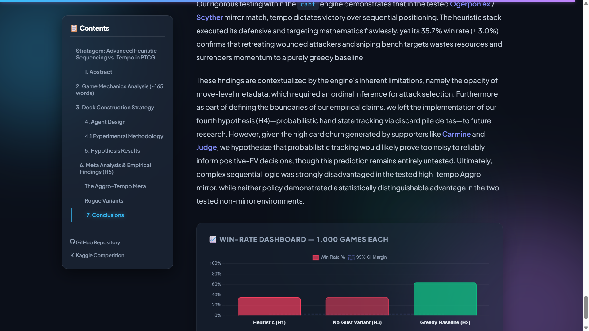

Our rigorous testing within the Kaggle `cabt` engine demonstrates that in high-lethality mirror matches, **tempo dictates victory over sequential positioning**. Retreating wounded attackers and sniping bench targets wastes critical resources and surrenders momentum to a purely greedy baseline.

### Key Takeaways

| Finding | Implication |
|:--------|:-----------|
| Heuristic stack loses 64.3% vs. greedy in the aggro mirror | Complex sequencing yields net-negative EV in high-tempo environments |
| Bench sniping (Gust) provides 0 measurable EV | Boss's Orders is too costly as a Supporter slot in fast mirrors |
| 993 statistically-correct retreats still lost | Correct defensive math does not equal correct strategic outcome |
| Statistical tie vs. Dragapult ex and Slowking | Heuristic disadvantage is environment-specific, not universal |
| Aggro-tempo archetypes = ~47% of the competitive field | Meta validates the prize-race model as the dominant baseline strategy |

### Future Work

- **H4 — Probabilistic Hand State Tracking:** Implement discard-pile delta tracking to infer opponent hand composition. The high card churn from *Carmine* and *Judge* likely makes this too noisy for positive EV, but formal ablation is needed.
- **Reinforcement Learning Baseline:** Use this heuristic as a reward-shaping scaffold for an RL agent trained on the `cabt` engine.
- **Adaptive Opponent Modeling:** Detect opponent archetype from early board states and dynamically adjust priority weights (e.g., suppress retreating vs. greedy aggro, enable it vs. control).
- **MCTS with Determinized Sampling:** Explore whether lightweight MCTS with information-set sampling can beat the greedy baseline without hitting the 30-minute Kaggle timeout constraint.

---

<div align="center">

**Stratagem-AI** is a Kaggle competition research project.
Built with the Kaggle cabt engine · Deployed on Vercel · Documented on YouTube

[](https://stratagem-ai-game.vercel.app/)
[](https://www.youtube.com/watch?v=dU2HvTKX6Ww)
[](https://www.kaggle.com/competitions/pokemon-tcg-ai-battle-challenge-strategy/writeups/stratagem-tempo-dominance)

</div>
